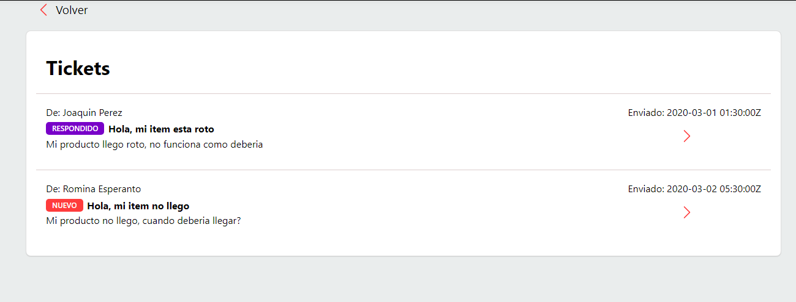

# tickets

## Project setup

#### Server:

```
pip install Flask
```

```
python server.py
```

If you need to set up a virtual environment, you can view the documentation [here](https://docs.python.org/3/library/venv.html) ⬅️ 


#### Client:

To install all the dependencies:

```
npm install
```

To run the app in the development mode:

```
npm start
```

Client is waiting for http://localhost:5000/getTickets

## Screenshot 
  


